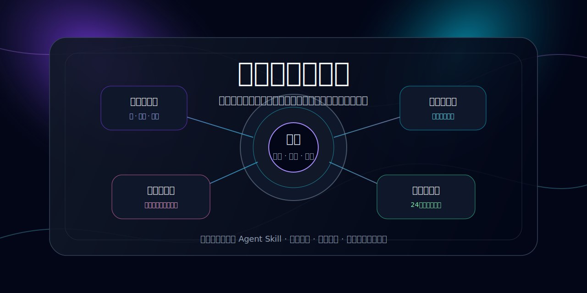

<p align="center">
  
</p>

<h1 align="center">平行自我委员会</h1>

<p align="center">
  <strong>把纠结变成一场有证据、有反证、有回滚线的内部董事会。</strong>
</p>

<p align="center">
  <a href="#这是什么">这是什么</a> ·
  <a href="#它解决什么问题">解决什么</a> ·
  <a href="#委员会成员">委员会成员</a> ·
  <a href="#输出长什么样">输出样式</a> ·
  <a href="#如何使用">如何使用</a> ·
  <a href="#开发与验证">开发验证</a>
</p>

<p align="center">
  
  
  
  
</p>

---

## 这是什么

**平行自我委员会**不是聊天机器人，不是鸡汤模板，也不是一个假装“接入成功”的应用。

它是一个中文优先的 **Agent 技能包**：当用户陷入“我要不要……”的纠结时，代理会调用这份技能，把问题拆成证据、反证、风险、可逆性、行动试验和回滚条件，然后召集多个“平行自我”开会。

最终目标只有一个：

> **不要让纠结继续在脑子里打转。把它变成今天就能验证的一小步。**

---

## 它解决什么问题

很多决策工具给出的建议都太虚：

- “听从内心。”
- “权衡利弊。”
- “勇敢一点。”
- “再等等看。”

这些话不是没道理，而是**没有落地条件**。

平行自我委员会强制每个观点都回答：

| 维度   | 它会追问什么                       |
| ------ | ---------------------------------- |
| 证据   | 这是真的发生了，还是只是你害怕？   |
| 反证   | 有哪些事实正在削弱这个判断？       |
| 风险   | 如果错了，最糟糕会损失什么？       |
| 可逆性 | 这个选择能不能撤回，撤回成本多高？ |
| 行动   | 24 小时内能做什么来获得新证据？    |
| 回滚   | 看到什么信号就应该停下或换路？     |

---

## 委员会成员

这不是一群“励志角色”。每个成员都有明确职责。

| 成员             | 负责什么                     | 典型问题                               |
| ---------------- | ---------------------------- | -------------------------------------- |
| 现实资源官       | 钱、时间、精力、健康、义务   | 你扛得住这个选择最无聊的后果吗？       |
| 长期主义者       | 五年后的代价、身份、机会成本 | 情绪退潮后，这个选择还成立吗？         |
| 反脆弱冒险派     | 上升空间、学习、试错、勇气   | 哪个小风险能换来真正的信息？           |
| 风险审计员       | 隐藏假设、失败路径、依赖条件 | 这个计划最可能在哪个显眼地方翻车？     |
| 情绪诚实者       | 恐惧、欲望、疲惫、羞耻、逃避 | 哪个情绪正在伪装成理性决定？           |
| 关系与伦理观察者 | 承诺、边界、他人代价、沟通   | 这个决定会让谁替你付成本？             |
| 行动设计师       | 下一步、验证、期限、回滚线   | 今天做什么能产生证据，而不是产生幻觉？ |

---

## 输出长什么样

技能会要求代理输出类似这样的结构：

```md
# 平行自我委员会

## 议题识别

- 决策：我要不要辞职做自己的产品？
- 选项：继续上班并验证 / 兼职验证 / 直接辞职
- 约束：现金流、用户验证、精力、时间窗口
- 风险：收入中断、产品无人付费、长期消耗
- 可逆性：中等
- 信心：中低

## 委员会发言

### 现实资源官

- 立场：不建议立刻裸辞，先把现金流和验证条件补齐。
- 支持证据：有 8 个月生活费，但还没有付费用户。
- 反对证据：当前工作持续消耗，拖太久也会损失机会。
- 最大风险：把“想逃离工作”误认为“产品已经成立”。
- 可逆性：中等，辞职后可回头但代价真实存在。
- 投票：准备条件

## 投票统计

- 立即行动：0
- 准备条件：2
- 继续等待：1
- 暂不执行：0
- 小步验证：3

## 最终决议

先小步验证，再准备过渡，不建议立刻裸辞。

## 24 小时最小行动

联系 5 个试用用户，提出明确付费方案，记录真实反馈。

## 7 天验证计划

第 1 天：付费访谈。
第 2 天：写出定价页。
第 3 天：尝试小额预售。
...

## 回滚条件

如果 7 天内没有任何付费信号，暂停辞职决定，继续缩小产品范围。
```

---

## 如何使用

把这个目录复制到你的 Agent 技能目录，或让代理直接读取：

```text
skills/parallel-me-council/SKILL.md
```

当用户说出这些话时，就应该触发：

- “我很纠结。”
- “我要不要辞职？”
- “我要不要继续这段关系？”
- “帮我做个决定。”
- “用平行自我委员会分析一下。”

---

## 安全边界

这个技能不做这些事：

- 不替代医生、律师、财务顾问、心理咨询师。
- 不对医疗、法律、投资、合同等高风险问题给绝对建议。
- 不把自伤、暴力、严重健康风险包装成“角色辩论”。
- 不假装调用了外部服务。
- 不要求用户交出隐私或密钥。

遇到高风险场景时，技能会从“委员会模式”切换为“安全优先模式”。

---

## 仓库结构

```text
skills/parallel-me-council/SKILL.md                 # 技能主体
skills/parallel-me-council/examples/                 # 中文场景示例
skills/parallel-me-council/references/decision-protocol.md
scripts/validate-skill.mjs                           # 技能校验
scripts/render-sample.mjs                            # 示例渲染
tests/                                                # 156 个自动化测试
assets/parallel-me-council-cover.svg                 # GitHub 首页视觉封面
```

---

## 开发与验证

```bash
npm install
npm run format:check
npm run typecheck
npm run lint
npm run test
npm run build
```

当前验证状态：

| 项目       | 状态       |
| ---------- | ---------- |
| 格式检查   | 通过       |
| 类型检查   | 通过       |
| 代码规范   | 通过       |
| 自动化测试 | 156 个通过 |
| 构建校验   | 通过       |

---

## 为什么要做成技能，而不是应用

因为这个项目真正有价值的不是按钮、面板或假连接测试，而是一套可复用的**决策思考协议**。

做成技能后，它可以被不同代理、不同编辑器、不同工作流复用。用户不需要再相信一个黑箱应用，只需要审查这份中文协议本身。

---

## 许可证

MIT
